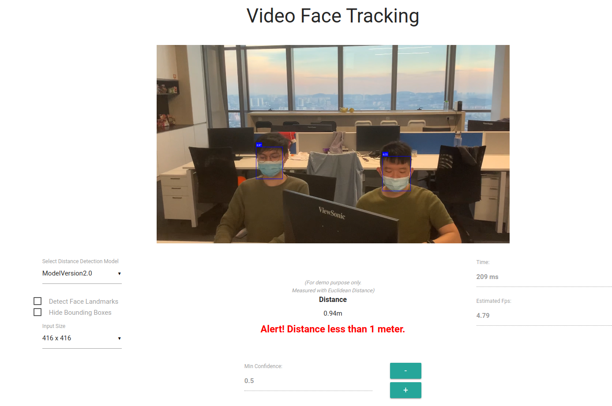

# 

## Physical Distancing

## The Problem We Want to Tackle

As much as we want the COVID-19 pandemic to be over as quickly as possible, the truth is this is not the first pandemic, and certainly not going to be the last. Physical distancing is a massive part of the effort to flatten the curve and might be here to stay for some time. Many technological innovations to encourage and enforce physical distancing have surfaced. But which one is the most effective and more likely to reach mass adoption? How can we track and monitor activities and behaviors without compromising privacy? How can we ensure useful information is collected for research purposes and is tamper-proof to ensure accuracy by leveraging blockchain? How can we make use of the data collected and prevent another pandemic? How can the Internet of Things (IoT) like connected appliances, wearable health monitors, ultra-high-speed wireless internet, or biometric cybersecurity scanners increase the efficiency of physical distancing solutions?

## Summary of Problem Statement

- Due to COVID-19, New Norm applying to our daily lives. Without further burden to Healthcare frontliners and government, how can we make use of Analytics to monitor and apply "Physical Distancing" efficiently?

- Governments all over the world are searching for solutions to contain the spread of COVID-19. Physical distancing measures such as stay-at-home orders and travel restrictions have been proven to slow the spread in many cases. How can we make use of analytics to create smarter solutions to help governments implement social or physical distancing measures?

## Example Solution

- An analytical model or solution that able to identify crowded places and predict any potential outbreak area.

- An analytical model or solution that able to monitor & alert of any lockdown violators.

## Start Up Physical Distancing Project

### Step 1 - Clone project

- Clone project `$ git clone https://github.com/maxonrow/challenge-distancing.git`

### Step 3 - Navigate to backend

- Go to directory `cd challenge-distancing/examples/examples-browser`

### Step 4 - Build & run backend

- run `npm i` & subsequently with `npm run start` & you should see output serving at `http://localhost:3000`

### Step 5 - Expected output

- 

### Step 6 - Checkout article

- checkout our [cookbook](https://medium.com/maxonrow/maxathon-challenge-1-physical-distancing-ea03769bbd43).
- please! remember to claps, follow & share. we will mint you something! You will find out soon!
